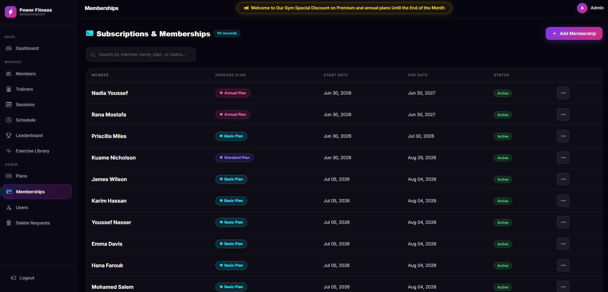
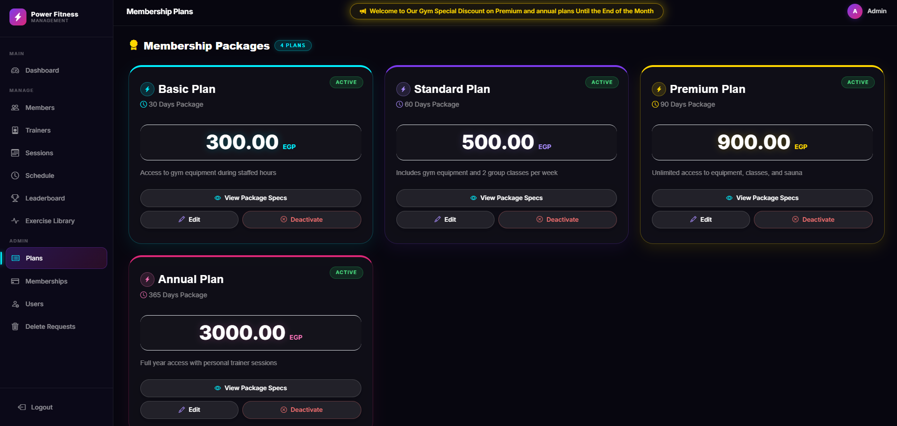
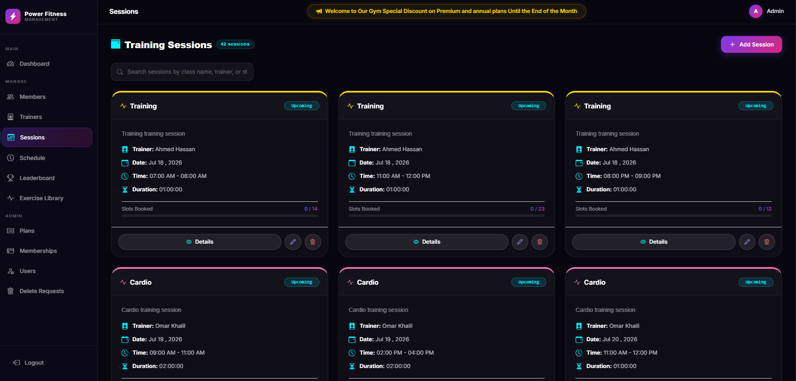
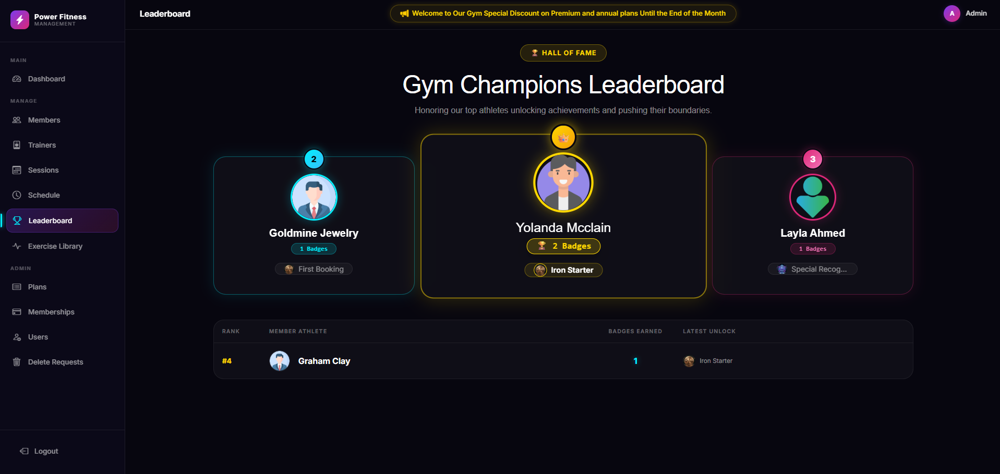

# 🏋️ Gym Management System

A full-featured gym management web application built with **ASP.NET Core MVC** using a clean **3-Tier Architecture**. Supports member self-service, health tracking, trainer management, session scheduling, bookings, and role-based authentication with an approval workflow for sensitive actions.

---
Live Demo: Check out the full gym system here https://fullgymsystem.runasp.net/Account/Login
---

## 🆕 Recent Updates

### 🎨 Full Mobile-Responsive Redesign
The entire UI has been rebuilt from the ground up with a dark glassmorphic design system:
- **New CSS variable design system** — cohesive color palette (`--accent`, `--purple`, `--pink`), glass effects, and Inter font throughout
- **Responsive sidebar navigation** — drawer-style hamburger menu on mobile/tablet replacing the collapsing navbar; zero horizontal overflow at 320px–768px
- **Animated dashboard** — circular SVG gauge stats and a live responsive ticker replace the static grid
- **Admin card redesign** — Member and Trainer cards use circular action toggles in the card footer with correct z-index stacking (dropdowns no longer render behind sibling cards)
- **Member space views** — Profile, Membership, Analytics, and Achievements pages optimized for all breakpoints

### 🎥 Exercise Video & Form Library
- New **Exercise** entity backed by SQL Server (`AddExercise` migration)
- `ExercisesController` with AJAX video lookup for the guide player
- `Views/Exercises/Index.cshtml` — guided video library browser with 3D form animations
- `Workouts/Create.cshtml` — integrated exercise guide player modal
- `DataSeeder` seeds 6 core exercises (Squat, Deadlift, Bench Press, Pull-Up, OHP, Barbell Row) with 3D animation video URLs on first run

### ⚡ DB Query Performance Optimizations
- Added `FindAllAsync(predicate, tracking, includes)` to `IGenericRepository<T>` / `GenericRepository<T>` — server-side predicate filtering eliminates full-table memory loads
- `BadgeService` refactored to use `FindAllAsync` with in-memory dictionaries, resolving N+1 query chains during gamification badge evaluation
- `Leaderboard.cshtml` cleaned up redundant per-render DB hits

### 🔐 Google OAuth & Email OTP
- **Google OAuth association fix** — existing local accounts auto-link to Google login on first OAuth sign-in if emails match
- **SMTP Email Service** — Brevo-backed `EmailService` sends real OTP emails for the Forgot Password flow (credentials via .NET User Secrets, never committed)

---

## 📸 Screenshots

### 🔑 Authentication & System Announcements

| Login Page | Gym Announcement Board |
| :---: | :---: |
|  |  |

### ⚙️ Admin & Manager Space

| Admin Dashboard | Add New Member |
| :---: | :---: |
|  |  |

| Memberships Management | Plans |
| :---: | :---: |
|  |  |

| Sessions | Session Schedule |
| :---: | :---: |
|  |  |

| User Management | Delete Requests |
| :---: | :---: |
|  |  |

### 🏋️ Member Self-Service Space

| Member Dashboard | Member Profile |
| :---: | :---: |
|  |  |

| My Membership | My Analytics |
| :---: | :---: |
|  |  |

| My Achievements & Badges | Community Leaderboard |
| :---: | :---: |
|  |  |

| Workout Journal | Exercise Video Library |
| :---: | :---: |
|  |  |

---

## 🏗️ Architecture

This project follows the **3-Tier Architecture** pattern, separating concerns across three distinct layers:

```
GymmanagmentSystem/
├── GymManagment.DAL/        # Data Access Layer  — Models, DbContext, Repositories, UnitOfWork, Identity
├── GymMangment.BLL/         # Business Logic Layer — Services, ViewModels, Mapping, Result Pattern
└── GymmanagmentSystem.PL/   # Presentation Layer  — Controllers, Views, wwwroot
```

| Layer | Project | Responsibility |
|-------|---------|----------------|
| **DAL** | `GymManagment.DAL` | Database models, EF Core, Identity, Generic Repository, Unit of Work |
| **BLL** | `GymMangment.BLL` | Business logic, service interfaces, ViewModels, AutoMapper profiles |
| **PL**  | `GymmanagmentSystem.PL` | MVC Controllers, Razor Views, UI, File uploads |

---

## ✨ Features

### Public / Guest
- ✅ Landing page with animated circular gauge stats (Total Members, Active Members, Trainers, Sessions by status)
- ✅ Self-registration — automatically creates a linked Member profile, assigns the **Member** role, and subscribes to the **Basic Plan**

### Members (Admin/Manager-managed)
- ✅ Full CRUD, health record tracking, required profile photo upload on Create
- ✅ Locked fields on edit (Name, DOB, Gender) to preserve identity integrity

### Trainers
- ✅ Full CRUD with specialty tracking (Cardio, Strength, Boxing, CrossFit)

### Plans
- ✅ List, view details, edit, Activate/Deactivate (soft delete)
- ✅ Members can browse active plans and switch their subscription directly from the Plans page

### Sessions
- ✅ Full CRUD with trainer/category specialty matching validation
- ✅ Status-aware UI (Upcoming / Ongoing / Completed)
- ✅ Auto-seeded 7 days of upcoming sessions on first run

### Memberships
- ✅ Assign member to a plan, auto-calculated end date based on plan duration
- ✅ Prevents duplicate active memberships per member
- ✅ Plan switching/upgrade flow for logged-in Members

### Sessions Schedule & Bookings
- ✅ Browse available sessions and book a spot (requires active membership)
- ✅ Bookings are now tied to the logged-in user's own Member profile — no booking on behalf of others
- ✅ Cancel bookings, attendance tracking, capacity/slot enforcement

### Member Self-Service Area
- ✅ **My Profile** — view and edit own contact/address details (Name, DOB, Gender locked)
- ✅ **My Membership** — current plan, price, start/end date, days remaining, quick link to switch plans
- ✅ **My Bookings** — view and cancel only their own session bookings
- ✅ **My Workout Journal** — log custom workouts, adding exercises, sets, weights, and reps with interactive history details
- ✅ **My Workout Plan** — generate rule-based weekly routines (Goals: Build Muscle, Lose Weight, Cardio) and copy days directly into the workout journal
- ✅ **My Achievements** — gamified badges hub (e.g. Early Bird, Iron Lifter) and a global community leaderboard
- ✅ **Exercise Library** — browse guided video library with 3D form animations for core lifts; integrated guide player on the workout creation page

### Authentication & Authorization
- ✅ ASP.NET Core Identity (custom `AppUser`, linked to a `Member` or `Trainer` record via `MemberId`/`TrainerId`)
- ✅ Roles: **Admin**, **Manager**, **Member**, **Trainer**
- ✅ Public registration → automatically linked Member profile + **Member** role + Basic Plan membership
- ✅ **Forgot Password with OTP** — self-service password recovery using 6-digit numeric OTP tokens sent via SMTP email
- ✅ **Google OAuth** — sign in with Google; existing accounts auto-link on first OAuth login if emails match
- ✅ Admin can assign/change roles and delete accounts via User Management page
- ✅ Manager can create Members/Trainers/Sessions but cannot delete directly — submits a **Delete Request** for Admin approval/rejection

### Responsive Design
- ✅ **Dark glassmorphic design system** — CSS variables, glass effects, Inter typography throughout
- ✅ **Responsive drawer sidebar** — hamburger-triggered drawer nav on mobile/tablet, zero horizontal overflow at 320px+
- ✅ **Animated dashboard gauges** — circular SVG progress rings and live stats ticker
- ✅ **Admin card redesign** — circular action toggles with correct z-index stacking across all breakpoints
- ✅ **Member space** — Profile, Membership, Analytics, Achievements optimized for 320px–1440px

### Data Seeding
- ✅ Plans, Categories, 4 Trainers, 10 Members (with avatar photos), 7 days of upcoming Sessions, 6 core Exercises with 3D guide videos seeded automatically on first run
- ✅ Roles (Admin, Manager, Member, Trainer) and default Admin + Manager accounts seeded on startup
- ✅ Idempotent — skips seeding if data already exists

---

## 🛠️ Tech Stack

| Technology | Usage |
|------------|-------|
| ASP.NET Core MVC (.NET 9) | Web framework |
| Entity Framework Core 9 | ORM / Database access |
| ASP.NET Core Identity | Authentication & Authorization |
| SQL Server | Database |
| AutoMapper | Object mapping (ViewModel ↔ Entity) |
| Bootstrap 5 | UI base / grid |
| Vanilla CSS (custom) | Dark glassmorphic design system |
| Bootstrap Icons | Icon set |
| C# | Primary language |

---

## 🧱 Design Patterns

| Pattern | Where Used |
|---------|-----------|
| **3-Tier Architecture** | Full project structure |
| **Generic Repository** | `IGenericRepository<T>` in DAL with `FindAllAsync` for server-side predicate filtering and eager-load includes |
| **Unit of Work** | `IUnitOfWork` wrapping all repositories |
| **Result Pattern** | `Result<T>` returned from all service methods |
| **AutoMapper** | `MappingProfile` in BLL |
| **TempData Alert System** | Global success/warning/error banners in `_Layout.cshtml`, auto-dismiss after 3s |
| **Approval Workflow** | Manager-submitted Delete Requests reviewed by Admin before destructive actions execute |
| **Identity-to-Domain Linking** | `AppUser.MemberId` / `AppUser.TrainerId` connect login accounts to domain profiles for self-service scoping |

---

## 🔐 Default Seeded Accounts

| Role | Email | Password |
|---|---|---|
| Admin | `admin@gymmanagement.com` | `Admin@1234` |
| Manager | `manager1@gymmanagement.com` | `Manager@1234` |
| Manager | `manager2@gymmanagement.com` | `Manager@1234` |

> ⚠️ Change these credentials before deploying to production.

---

## 🚀 Getting Started

### Prerequisites

- [.NET 9 SDK](https://dotnet.microsoft.com/download)
- [SQL Server](https://www.microsoft.com/en-us/sql-server)
- Visual Studio 2022+ or VS Code

### Installation

1. **Clone the repository**
   ```bash
   git clone https://github.com/Moha-sami/Gym_managment_System.git
   cd Gym_managment_System
   ```

2. **Set up the connection string**

   In `GymmanagmentSystem/appsettings.json`, update:
   ```json
   "ConnectionStrings": {
     "DefaultConnection": "Server=YOUR_SERVER;Database=GymDB;Trusted_Connection=True;"
   }
   ```

3. **Configure SMTP (optional — for OTP email)**

   Use .NET User Secrets to avoid committing credentials:
   ```bash
   dotnet user-secrets set "SmtpSettings:Password" "YOUR_SMTP_KEY" --project GymmanagmentSystem
   ```

4. **Apply migrations**
   ```bash
   dotnet ef database update --project GymManagment.DAL --startup-project GymmanagmentSystem
   ```

5. **Run the application**
   ```bash
   dotnet run --project GymmanagmentSystem
   ```

   On first run, the database will be automatically seeded with sample Plans, Categories, Trainers, Members, Sessions, Exercises, Roles, and Admin/Manager accounts.

6. Open your browser, register a new account (gets a Member profile + Basic Plan automatically), or log in with the Admin account above to manage the gym.

---

## 📁 Project Structure

```
GymManagment.DAL/
├── Models/
│   ├── BaseEntity.cs
│   ├── GymUser.cs (abstract)
│   ├── AppUser.cs (Identity, linked to Member/Trainer)
│   ├── Member.cs
│   ├── HealthRecord.cs
│   ├── Trainer.cs
│   ├── Plans.cs
│   ├── Membership.cs
│   ├── Session.cs
│   ├── Booking.cs
│   ├── DeleteRequest.cs
│   ├── Exercise.cs (guided video library entries)
│   ├── WorkoutLog.cs / WorkoutExerciseLog.cs / WorkoutSetLog.cs
│   ├── BadgeDefinition.cs / MemberBadge.cs
│   ├── MemberWorkoutPlan.cs
│   └── Enum/ (Gender, Specialty, Categories, DeleteTargetType, DeleteRequestStatus)
├── DbContext/
│   └── GymDbcontext.cs (IdentityDbContext)
└── Repositories/
    ├── Interfaces/ (IGenericRepository<T> with FindAllAsync, IUnitOfWork)
    └── Class/ (GenericRepository<T>, UnitOfWork)

GymMangment.BLL/
├── Common/
│   └── Result.cs
├── Mapping/
│   └── MappingProfile.cs
├── Services/
│   ├── Interfaces/
│   └── Class/ (MemberService, PlanService, TrainerService, SessionService,
│                MembershipService, ScheduleService, AnalyticsService,
│                BadgeService, WorkoutService, WorkoutPlanService, FileService)
└── ViewModels/
    ├── MemberViewModels/
    ├── HealthRecordsViewModels/
    ├── PlansViewModels/
    ├── TrainerViewModels/
    ├── SessionsViewModels/
    ├── MembershipViewModels/
    ├── BookingViewModels/
    ├── WorkoutViewModels/
    ├── WorkoutPlanViewModels/
    ├── BadgeViewModels/
    ├── AnalyticsViewModels/
    └── AccountViewModels/ (Login, Register, ForgotPassword, ResetPassword, VerifyOtp)

GymmanagmentSystem.PL/
├── Controllers/
│   ├── HomeController.cs
│   ├── MembersController.cs (incl. MyProfile)
│   ├── PlansController.cs
│   ├── TrainersController.cs
│   ├── SessionsController.cs
│   ├── MembershipsController.cs (incl. MyMembership, UpgradePlan)
│   ├── SessionsScheduleController.cs
│   ├── BookingsController.cs (incl. MyBookings)
│   ├── AccountController.cs (incl. Google OAuth, OTP Forgot Password)
│   ├── AdminController.cs
│   ├── ExercisesController.cs
│   ├── WorkoutsController.cs
│   ├── AchievementsController.cs
│   ├── AnalyticsController.cs
│   ├── WorkoutPlanController.cs
│   └── DeleteRequestsController.cs
├── Services/
│   ├── FileService.cs
│   └── EmailService.cs (SMTP via Brevo)
├── DataSeeder.cs
├── Views/
│   └── (one folder per controller, plus Shared/_Layout.cshtml)
└── wwwroot/
    ├── css/ (style.css, custom.css)
    ├── data/ (announcement.json)
    └── images/
        ├── avatars/ (seeded member default photos)
        └── uploads/ (member profile photos uploaded via Create)
```

---

## 👨‍💻 Author

**Moha-sami** — [@Moha-sami](https://github.com/Moha-sami)

---

## 📄 License

This project is open source and available under the [MIT License](LICENSE).
